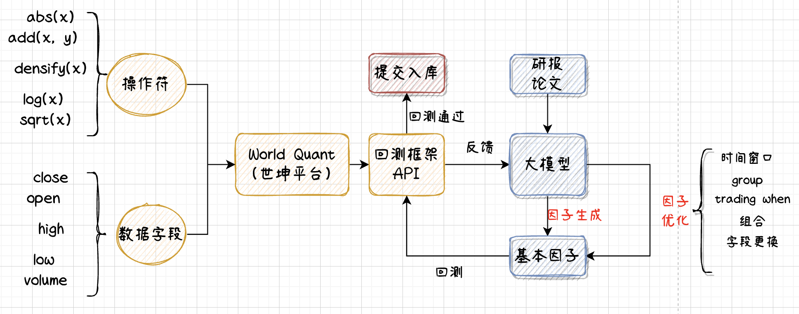

# auto_alpha_factory
基于大语言模型自动挖掘和优化alpha，借助于deepseek大模型和世坤量化平台实现因子自动挖掘优化
# 使用说明
## 1 第三方依赖
我这里使用了世坤量化回测API和deepseek大模型，因此需要注册worldquant账号，同时申请deepseek API。注册完成后，在上一级的目录中创建user_config.txt文件，填充文件内容如下：

“worldquant账号”  
“worldquant密码”  
“deepseek API key”

## 2 思路

整体思路如上图所示，大致分为两部分：回测模块和因子模块。

回测模块：我使用了World Quant提供的回测服务，平台提供了很多基础运算符及丰富的数据字段，不过基础阶段我们只能选择有限的标的进行回测，如果成为平台的顾问，将会得到更高权限。

因子模块：原计划是希望能从研报、论文提取因子，这样的好处是因子本身有一定研究基础，在可解释性方面会更有优势，不过当前还没有实现从研报、论文到因子的转换过程。后续会持续完成和更新这部分。目前的因子处理过程如下：

- 初始化阶段，通过promting让大模型生成一个alpha并进行回测；

- 记录alpha表达式和回测指标结果，通过promoting让大模型优化alpha

- 只是为了实验验证，目前的优化轮次控制在10次之内；

- 目标是夏普大于1.5，fitness大于1.25，回撤和换手率小于0.1

## 3 运行
在jupyter notebook中运行即可得到结果，注意：代码只是一个简单的demo，用于作者自己学习和尝试。

### 看了一篇论文，用蒙特卡洛树搜索结合大模型来进行因子挖掘，但没有开源代码